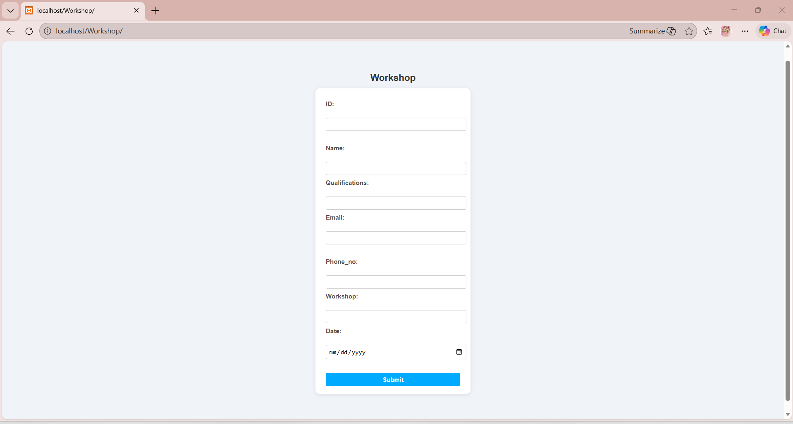
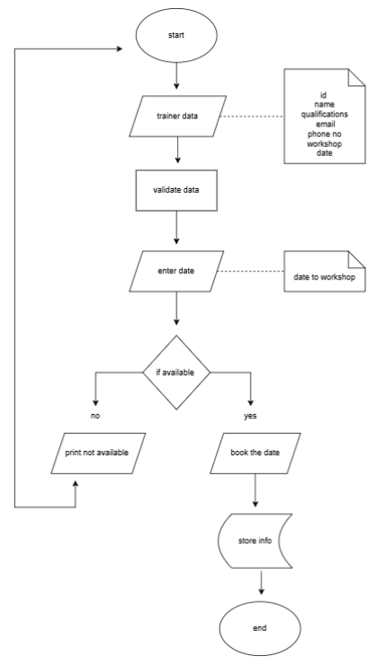

# workshop_website
A simple workshop registration system built with HTML, CSS, PHP, and MySQL (XAMPP)

## System Flowchart
 

# Workshop Registration System

A simple **workshop registration system** built using HTML, CSS, PHP, and MySQL (XAMPP).

## Features
- User registration form for workshops
- Data stored in MySQL database
- Auto-increment ID for unique records
- Date input handled with HTML date picker
- Simple, clean UI using CSS

## Technologies Used
- **Frontend:** HTML, CSS
- **Backend:** PHP
- **Database:** MySQL
- **Local server: XAMPP

## How to Run
1. Install XAMPP and start **Apache** and **MySQL**.
2. Create a database using `database.sql` in **phpMyAdmin**.
3. Place the project folder inside `htdocs`.
4. Open `http://localhost/Workshop` in your browser.
5. Fill out the form and submit to store data in MySQL.

## Notes
- ID field is **auto-generated** using AUTO_INCREMENT.
- Date field uses `<input type="date">` for correct formatting.
- Make sure PHP and MySQL are running before testing.
